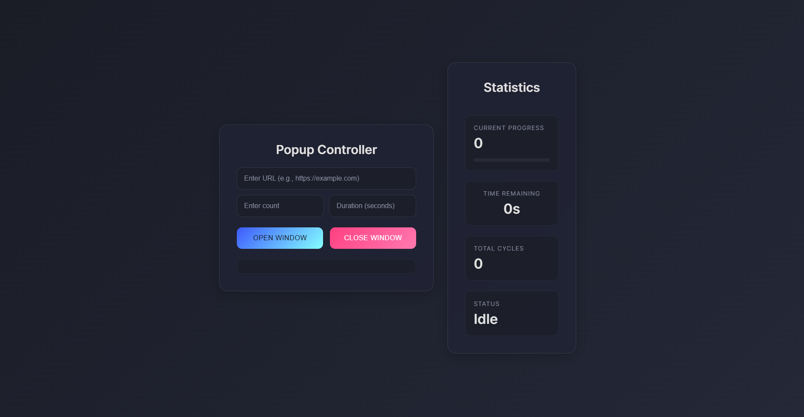

# Popup Controller

A modern, user-friendly web application for managing and automating popup window operations with real-time statistics and progress tracking.



## Features

-   🪟 Automated popup window management
-   📊 Real-time statistics dashboard
-   ⏲️ Customizable timing controls
-   📈 Progress tracking with visual feedback
-   🎯 Cycle counting and status monitoring
-   🎨 Modern glassmorphic UI design

## Demo

[Live Demo](https://dulina2004.github.io/pop-up-window-automator-web-RnD/)

## Technologies Used

-   HTML5
-   CSS3
-   Java Script

## Research & Development

### Window Management System

The application implements advanced window management features:

-   Controlled popup window creation and destruction
-   Failsafe mechanisms to prevent orphaned windows
-   Automated cleanup on page unload
-   Window state tracking and verification

### Security Considerations

-   Built-in popup blocking detection
-   User permission handling
-   Secure window opening protocols
-   Cross-origin considerations

### Performance Optimizations

-   Efficient timer management
-   Asynchronous operation handling
-   Memory leak prevention
-   Resource cleanup

## Installation

1. Clone the repository:

```bash
git clone https://github.com/dulina2004/pop-up-window-automator-web-RnD.git
```

2. Navigate to the project directory:

```bash
cd pop-up-window-automator-web-RnD
```

3. Open `index.html` in your preferred browser

## Usage

1. Enter the target URL in the URL input field
2. Set the desired count of popup cycles
3. Specify the duration (in seconds) for each popup window
4. Click "Open Window" to start the automation
5. Monitor progress in the statistics dashboard
6. Use "Close Window" to stop the process at any time

## Features Breakdown

### Main Controller

-   URL input field
-   Cycle count configuration
-   Duration settings
-   Start/Stop controls

### Statistics Dashboard

-   Current progress indicator
-   Time remaining display
-   Total cycles counter
-   Operation status monitor
-   Visual progress bar

### Special Functionalities

#### Popup Window Management

-   Configurable window dimensions (800x600 default)
-   Automatic window positioning
-   Focus management
-   Window state verification

#### Timer System

-   Precise countdown timer
-   Interval management
-   Automatic cleanup
-   Visual feedback

#### Progress Tracking

-   Real-time progress updates
-   Visual progress bar
-   Cycle counting
-   Status monitoring
